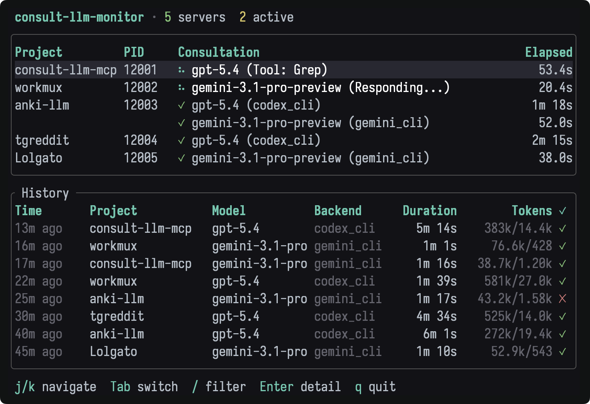
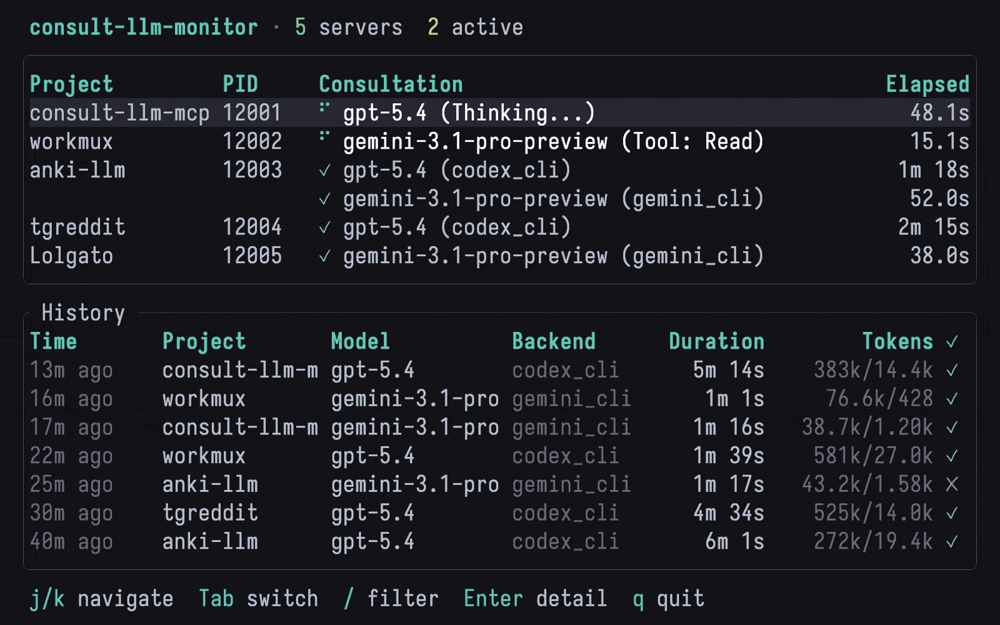

# consult-llm

`consult-llm` is a CLI for consulting stronger AI models from your existing
agent workflow. It supports GPT-5.5/5.4, Gemini 3.1 Pro, Claude Opus 4.7,
DeepSeek V4 Pro, and MiniMax M2.7, with API and local CLI backends, multi-turn
threads, git diff context, web-mode clipboard export, and a live monitor TUI.

1. Install skills into your agent (Claude Code, Codex, OpenCode)
2. Trigger with a slash command — `/consult`, `/debate`, `/collab`
3. The skill pipes your prompt into `consult-llm`, which calls the backend and streams the response back inline

[Quick start](#quick-start) · [Usage](#usage) · [Configuration](#configuration) · [Skills](#skills) · [Monitor](#monitor) · [Changelog](CHANGELOG.md)

> [!NOTE]
> This project previously used MCP as its transport layer. If you were using that version, see the [migration guide](#migrating-from-mcp) below.

## Features

- Query powerful AI models (GPT-5.5/5.4, Gemini 3.1 Pro, Claude Opus 4.7, DeepSeek V4 Pro, MiniMax M2.7) with relevant file context
- [Gemini CLI backend](#gemini-cli): use the `gemini` CLI for Gemini models
- [Codex CLI backend](#codex-cli): use the `codex` CLI for OpenAI models
- [Cursor CLI backend](#cursor-cli): route GPT and Gemini through `cursor-agent`
- [OpenCode backend](#opencode): use `opencode` with Copilot, OpenRouter, or 75+ providers
- [Multi-turn conversations](#multi-turn-conversations): resume sessions across requests with `thread_id`
- [Web mode](#web-mode): copy formatted prompts to clipboard for browser-based LLMs
- [Skills](#skills): multi-LLM debate, collaboration, and consultation workflows
- [Monitor TUI](#monitor): real-time dashboard for active runs and history



## Quick Start

1. Install the binaries:

```bash
curl -fsSL https://raw.githubusercontent.com/raine/consult-llm-mcp/main/scripts/install.sh | bash
```

2. Pick a backend and scaffold your config:

```bash
consult-llm init-config
```

CLI backends are the easiest to start with if you have an existing subscription (no API key needed):

```bash
consult-llm config set gemini.backend gemini-cli   # requires: gemini login
consult-llm config set openai.backend codex-cli    # requires: codex login
```

Or set API keys as environment variables:

```bash
export OPENAI_API_KEY=your_openai_key
export GEMINI_API_KEY=your_gemini_key
```

3. Install the skills so your agent can call `consult-llm` for you:

```bash
consult-llm install-skills
```

Then invoke skills from inside your agent (see [Usage](#usage) right below).

## Example workflows

Some real-world examples. Click to expand.

<details>
<summary>Explain the problem, and tell CC to consult a smarter LLM</summary>

```
  <Some long explanation of the issue here>

  Consult LLM for assistance, use gemini

⏺ I see the issue! The problem is that the frontend is trying to use the hint
  for "isn't" but the server generated a hint for "isn't it" (the full phrase).
  This is a mismatch between how the frontend segments text and how the server
  generates hints.

  Let me consult the LLM to get assistance on this segmentation mismatch issue.

⏺ Write(hint-segmentation-issue.md)
  ⎿  Wrote 53 lines to hint-segmentation-issue.md
     # Hint Segmentation Mismatch Issue
     ## Problem Description
     There's a mismatch between how the frontend segments text for clickable
     words and how the backend generates hints. This causes hint unlocking to
     fail when the segments don't match exactly.
     ## Example Case
     **Original Text**: "Hello! Nice weather, isn't it?"
     … +43 lines (ctrl+r to expand)

⏺ Bash(cat hint-segmentation-issue.md | consult-llm -m gemini -f hint-segmentation-issue.md -f web/src/components/HintsText.tsx -f web/src/utils/hints.ts -f server/src/routes/public/hints.ts -f server/src/llm/hints.ts)
  ⎿  [model:gemini-3.1-pro-preview] [thread_id:a3f7c...]

     An excellent analysis of the problem. The root cause has been correctly
     identified: a race condition within the `handleConfirmGenerateHints`
     function in `HintsText.tsx`. The component state updates in the background
     after `await generateHints()`, but the function continues executing with a
     stale `activeSegment` variable, causing it to request a hint for a smaller
     text segment ( e.g., "isn't") instead of the full, newly-available hint
     phrase (e.g., "isn't it").
     … +607 lines (ctrl+r to expand)

⏺ Perfect! The LLM identified the core issue - there's a race condition in
  handleConfirmGenerateHints where the function uses stale state after async
  operations. The solution is to re-target the hint key after generation to
  find the correct matching hint.

  Let me implement this solution:

⏺ Update Todos
  ⎿  ☐ Fix hint segmentation mismatch by implementing smarter hint key
       targeting in handleConfirmGenerateHints
```

</details>

<details>
<summary>Using web mode to copy prompts to clipboard for browser-based LLMs</summary>

```
> I need help implementing a -b/--background flag for my Rust CLI. Use consult LLM with web mode

⏺ I'll use web mode to copy the formatted prompt to your clipboard so you can
  paste it into any browser-based LLM service.

⏺ Bash(cat <<'EOF' | consult-llm -m gemini --web -f src/cli.rs -f src/workflow.rs -f src/tmux.rs
  What is the best approach to implement a -b/--background flag for the
  "workmux add" command that creates a tmux window in the background without
  switching to it?

  The current implementation automatically switches to the newly created window
  via `tmux::select_window()` in the `setup_environment()` function. I need to
  make this behavior conditional based on a flag passed from the CLI.

  Consider:
  1. Where should the background flag be threaded through the call chain?
  2. Should I modify the existing SetupOptions struct or add a parameter?
  3. What's the most maintainable approach given the codebase structure?
  4. Are there any edge cases to consider (e.g., should select_pane also be
     conditional)?
  EOF)
  ⎿  ✓ Prompt copied to clipboard!

     Please paste it into your browser-based LLM service and share the response
     here before I proceed with any implementation.

     Note: File paths were included:
       - src/cli.rs
       - src/workflow.rs
       - src/tmux.rs

> [User pastes the response from the external LLM]

⏺ Thank you! Based on the recommendations, I'll now implement the solution...
```

This is useful when:

- You want to use a free browser-based LLM service instead of API credits
- You prefer a specific LLM's web interface
- You want to review the full prompt before submitting it

</details>

<details>
<summary>Debugging Neovim plugin treesitter API breakage</summary>

````
⏺ Fixed! Added nil checks for both node and child and updated the iter_matches call to handle the newer API properly.

> Still not working:

  E5108: Error executing lua /Users/raine/code/testonly.nvim/lua/testonly.lua:92: attempt to call method 'child' (a nil value)
  stack traceback:
          /Users/raine/code/testonly.nvim/lua/testonly.lua:92: in function 'reset_all_exclusive'
          /Users/raine/code/testonly.nvim/lua/testonly.lua:110: in function 'reset_all_exclusive'
          [string ":lua"]:1: in main chunk

  Ask gemini

⏺ Let me consult with a more powerful AI to understand the current Neovim treesitter API changes:

⏺ Bash(cat <<'EOF' | consult-llm -m gemini -f lua/testonly.lua
  I'm debugging a Neovim plugin that's broken due to treesitter API changes.
  The error is "attempt to call method 'child' (a nil value)" on line 92. The
  code is trying to access child nodes from treesitter matches but the API
  seems to have changed in newer Neovim versions.

  Here's the problematic code:
  ```lua
  for _, match, _ in parsed_query:iter_matches(root, bufnr, start_row, end_row) do
      for id, node in pairs(match) do
          local name = parsed_query.captures[id]
          if name == "call" and node then
              local child = node:child(0)  -- ERROR HERE
              if child then
                  local text = vim.treesitter.get_node_text(child, bufnr)
                  -- ... rest of logic
              end
          end
      end
  end
  ```

  What's the correct way to iterate over treesitter query matches and access
  child nodes in current Neovim versions? What API changes should I be aware of?
  EOF)
  ⎿  [model:gemini-3.1-pro-preview] [thread_id:b9e2a...]

     Problem
     -------

     … +93 lines (ctrl+r to expand)

⏺ Perfect! The issue is that iter_matches() can return nil nodes in the match table. Let me fix this by switching to the recommended iter_captures() approach:

⏺ Update(lua/testonly.lua)
  ⎿  Updated lua/testonly.lua with 7 additions and 10 removals
       85      local root = parser:parse()[1]:root()
       86      local start_row, _, end_row, _ = root:range()
       87
       88 -    for _, match, _ in parsed_query:iter_matches(root, bufnr, start_row, end_row) do
       89 -      for id, node in pairs(match) do
       90 -        local name = parsed_query.captures[id]
       91 -        if name == "call" and node then
       92 -          local child = node:child(0)
       93 -          if child then
       94 -            local text = vim.treesitter.get_node_text(child, bufnr)
       88 +    for id, node, _ in parsed_query:iter_captures(root, bufnr, start_row, end_row) do
       89 +      if parsed_query.captures[id] == "call" then
       90 +        local first_child = node:named_child(0)
       91 +        if first_child then
       92 +          local text = vim.treesitter.get_node_text(first_child, bufnr)
       93
       94 -            if text == "it.only" or text == "describe.only" then
       95 -              toggle_test_exclusive(child)
       96 -            end
       94 +          if text == "it.only" or text == "describe.only" then
       95 +            toggle_test_exclusive(first_child)
       96            end
       97          end
       98        end
````

</details>

<details>
<summary>Using slash command to consult multiple LLMs for comparison</summary>

```
> /consult The branch completions should dynamic. Git should be called only when
using tab to autocomplete. Ask gemini and codex

⏺ I'll consult both Gemini and Codex about making the branch completions dynamic
  (only calling git when tab-completing). Let me gather the relevant context first.

⏺ Bash(cat <<'EOF' | consult-llm -m gemini -f src/cli.rs -f src/git.rs
  I have a Rust CLI tool using clap that needs dynamic shell completions.
  Currently, the branch completions are generated at completion script generation
  time via `possible_values()`. Instead, I need the git operations to only run
  when the user presses TAB to autocomplete.

  Current setup:
  1. `WorktreeBranchParser` implements `TypedValueParser` with `possible_values()`
     that calls git
  2. Shell completions are generated via clap_complete's `generate()` function
  3. The completions are sourced at shell startup: `source <(workmux completions zsh)`

  The problem: Running `workmux completions zsh` takes ~210ms because it runs git
  operations during completion generation, not during actual tab completion.

  How can I implement truly dynamic completions where git is only called when the
  user presses TAB? What's the best approach with clap and clap_complete for zsh?
  EOF)
  ⎿  [model:gemini-3.1-pro-preview] [thread_id:c1d4e...]

     The root cause of the slow startup (~210ms) is that `clap_complete::generate()`
     executes your `possible_values()` logic (git operations) *while generating the
     script*. This bakes the *current* branches into the static script, which is both
     slow (happens every time you `source` it) and incorrect (branches become stale).
     … +116 lines (ctrl+o to expand)


⏺ Bash(cat <<'EOF' | consult-llm -m codex -f src/cli.rs -f src/git.rs
  I have a Rust CLI tool using clap that needs dynamic shell completions.
  Currently, the branch completions are generated at completion script generation
  time via `possible_values()`. Instead, I need the git operations to only run
  when the user presses TAB to autocomplete.

  Current setup:
  1. `WorktreeBranchParser` implements `TypedValueParser` with `possible_values()`
     that calls git
  2. Shell completions are generated via clap_complete's `generate()` function
  3. The completions are sourced at shell startup: `source <(workmux completions zsh)`

  The problem: Running `workmux completions zsh` takes ~210ms because it runs git
  operations during completion generation, not during actual tab completion.

  How can I implement truly dynamic completions where git is only called when the
  user presses TAB? What's the best approach with clap and clap_complete for zsh?
  EOF)
  ⎿  [model:gpt-5.1-codex-max] [thread_id:d2f5b...]

     **Findings**
     - `WorktreeBranchParser::possible_values` (`cli.rs:41-72`) runs git during script
       generation, so `workmux completions zsh` always pays the git cost (~210ms) even
       though the result is only needed at tab time.
     … +77 lines (ctrl+o to expand)


⏺ Summary from Gemini and Codex

  Both agree on the same solution:

  Root Cause

  clap_complete::generate() calls possible_values() during script generation, not
  at tab-completion time. This means git runs every shell startup.

...
```

This example shows using the `/consult` slash command to ask multiple LLMs
(Gemini and Codex) about the same problem **in parallel** and compare their
responses. Both LLMs independently arrived at the same solution, providing
confidence in the approach.

</details>

## Usage

The CLI is invoked by your agent via the installed skills; you don't call it directly. From inside Claude Code, OpenCode, or Codex:

```
/consult what's the best way to model this state machine?
/consult --gemini review this design for edge cases
/debate should this be a separate service or stay in the monolith?
```

### CLI utilities

```bash
consult-llm models                    # list available models and resolved selectors
consult-llm doctor                    # diagnose backend auth and config
consult-llm config set <key> <value>  # set a config value (user config by default)
consult-llm init-config               # scaffold ~/.consult-llm/config.yaml
consult-llm init-prompt               # scaffold ~/.consult-llm/SYSTEM_PROMPT.md
consult-llm install-skills            # install bundled skills to platform skill dirs
consult-llm update                    # self-update the binary
```

`consult-llm doctor` checks that each provider's backend dependency (API key or CLI binary) is satisfied, shows which config files were loaded, and validates session storage. Pass `--verbose` to see all config keys including unset defaults.

## Backends

Each model resolves to a provider backend.

| Backend    | Description                  | When to use                                          |
| ---------- | ---------------------------- | ---------------------------------------------------- |
| API        | Direct provider API calls    | You have API keys and want the simplest setup        |
| Gemini CLI | Shells out to `gemini`       | Free Gemini quota or existing Google tooling         |
| Codex CLI  | Shells out to `codex`        | OpenAI models via Codex subscription                 |
| Cursor CLI | Shells out to `cursor-agent` | Route GPT and Gemini through Cursor                  |
| OpenCode   | Shells out to `opencode`     | Use Copilot, OpenRouter, or other OpenCode providers |

### Gemini CLI

Requirements:

1. Install the [Gemini CLI](https://github.com/google-gemini/gemini-cli)
2. Run `gemini login`

```bash
consult-llm config set gemini.backend gemini-cli
```

### Codex CLI

Requirements:

1. Install Codex CLI
2. Run `codex login`

```bash
consult-llm config set openai.backend codex-cli
consult-llm config set openai.reasoning_effort high  # none | minimal | low | medium | high | xhigh
```

### Cursor CLI

```bash
consult-llm config set openai.backend cursor-cli
consult-llm config set gemini.backend cursor-cli
```

If your prompts need shell commands in Cursor CLI ask mode, allow them in
`~/.cursor/cli-config.json`.

### OpenCode

```bash
consult-llm config set openai.backend opencode
consult-llm config set openai.opencode_provider openai  # optional: override the OpenCode provider
consult-llm config set gemini.backend opencode
consult-llm config set opencode.default_provider copilot  # applies to providers without an override
```

## Multi-turn conversations

CLI backends support multi-turn conversations. The first response includes a
`[thread_id:xxx]` prefix — pass that ID back with `--thread-id` to continue
the conversation with full context from prior turns.

```
> Ask codex what's the best caching strategy for our read-heavy API

⏺ Bash(cat <<'EOF' | consult-llm -m codex
  What's the best caching strategy for a read-heavy API?
  EOF)
  ⎿  [model:gpt-5.5] [thread_id:thread_b1ff711...]

     Redis with TTL-based invalidation. Set short TTLs for volatile data ...

⏺ Codex recommends Redis with TTL-based invalidation — but our payment
  endpoints need strong consistency. Let me push back on that.

⏺ Bash(cat <<'EOF' | consult-llm -m codex --thread-id thread_b1ff711...
  What if we need strong consistency guarantees? Does that change your
  recommendation?
  EOF)
  ⎿  [model:gpt-5.5] [thread_id:thread_b1ff711...]

     Yes — with strong consistency, the TTL approach breaks down. Consider
     write-through caching or cache invalidation on writes instead ...

⏺ Codex revised its recommendation based on the consistency constraint. I'll
  use write-through caching for the payment endpoints.
```

This works with all CLI backends (Gemini CLI, Codex CLI, Cursor CLI). See the
[debate skills](#skills) for multi-LLM workflows that use thread IDs to
maintain context across debate rounds.

## Configuration

### Config files

consult-llm reads layered YAML config files. Resolution order (highest to lowest precedence):

1. Environment variables
2. `.consult-llm.local.yaml` (project-local overrides, not committed to git)
3. `.consult-llm.yaml` (committed project config)
4. `~/.consult-llm/config.yaml` (user config)

Project files are discovered by walking up from the current directory to the nearest `.git` root or `$HOME`.

Scaffold the user config and set values:

```bash
consult-llm init-config
consult-llm config set default_model gemini
consult-llm config set gemini.backend gemini-cli
# Write to project config instead of user config:
consult-llm config set --project default_model openai
# Write to local project overrides (not committed):
consult-llm config set --local openai.backend codex-cli
```

Values are parsed as YAML, so booleans and lists work naturally:

```bash
consult-llm config set no_update_check true
consult-llm config set allowed_models '[gemini, openai]'
```

Example `~/.consult-llm/config.yaml`:

```yaml
default_model: gemini

gemini:
  backend: gemini-cli

openai:
  backend: codex-cli
  reasoning_effort: high

opencode:
  default_provider: copilot
```

### API keys

API keys cannot go in config files and must be set as environment variables:

- `OPENAI_API_KEY`
- `GEMINI_API_KEY`
- `ANTHROPIC_API_KEY`
- `DEEPSEEK_API_KEY`
- `MINIMAX_API_KEY`

### Custom system prompt

```bash
consult-llm init-prompt   # scaffold ~/.consult-llm/SYSTEM_PROMPT.md
```

Override the path in config:

```yaml
system_prompt_path: /path/to/project/.consult-llm/SYSTEM_PROMPT.md
```

<details>
<summary>All environment variables</summary>

Environment variables override config file values.

| Variable                                 | Description                                                   | Allowed values                                 | Default                           |
| ---------------------------------------- | ------------------------------------------------------------- | ---------------------------------------------- | --------------------------------- |
| `OPENAI_API_KEY`                         | OpenAI API key                                                |                                                |                                   |
| `GEMINI_API_KEY`                         | Gemini API key                                                |                                                |                                   |
| `ANTHROPIC_API_KEY`                      | Anthropic API key                                             |                                                |                                   |
| `DEEPSEEK_API_KEY`                       | DeepSeek API key                                              |                                                |                                   |
| `MINIMAX_API_KEY`                        | MiniMax API key                                               |                                                |                                   |
| `CONSULT_LLM_DEFAULT_MODEL`              | Model or selector to use when `-m` is omitted                 | selector or exact model ID                     | first available                   |
| `CONSULT_LLM_GEMINI_BACKEND`             | Backend for Gemini models                                     | `api` `gemini-cli` `cursor-cli` `opencode`     | `api`                             |
| `CONSULT_LLM_OPENAI_BACKEND`             | Backend for OpenAI models                                     | `api` `codex-cli` `cursor-cli` `opencode`      | `api`                             |
| `CONSULT_LLM_DEEPSEEK_BACKEND`           | Backend for DeepSeek models                                   | `api` `opencode`                               | `api`                             |
| `CONSULT_LLM_MINIMAX_BACKEND`            | Backend for MiniMax models                                    | `api` `opencode`                               | `api`                             |
| `CONSULT_LLM_ANTHROPIC_BACKEND`          | Backend for Anthropic models                                  | `api`                                          | `api`                             |
| `CONSULT_LLM_ALLOWED_MODELS`             | Comma-separated allowlist; restricts which models are enabled | model IDs                                      | all                               |
| `CONSULT_LLM_EXTRA_MODELS`               | Comma-separated extra model IDs to add to the catalog         | model IDs                                      |                                   |
| `CONSULT_LLM_CODEX_REASONING_EFFORT`     | Reasoning effort for Codex CLI backend                        | `none` `minimal` `low` `medium` `high` `xhigh` | `high`                            |
| `CONSULT_LLM_OPENCODE_PROVIDER`          | Default OpenCode provider prefix for all models               | provider name                                  | per-model default                 |
| `CONSULT_LLM_OPENCODE_OPENAI_PROVIDER`   | OpenCode provider for OpenAI models                           | provider name                                  | `openai`                          |
| `CONSULT_LLM_OPENCODE_GEMINI_PROVIDER`   | OpenCode provider for Gemini models                           | provider name                                  | `google`                          |
| `CONSULT_LLM_OPENCODE_DEEPSEEK_PROVIDER` | OpenCode provider for DeepSeek models                         | provider name                                  | `deepseek`                        |
| `CONSULT_LLM_OPENCODE_MINIMAX_PROVIDER`  | OpenCode provider for MiniMax models                          | provider name                                  | `minimax`                         |
| `CONSULT_LLM_SYSTEM_PROMPT_PATH`         | Path to a custom system prompt file                           | file path                                      | `~/.consult-llm/SYSTEM_PROMPT.md` |
| `CONSULT_LLM_NO_UPDATE_CHECK`            | Disable background update checks                              | `1` `true` `yes`                               |                                   |

</details>

## Logging

All prompts and responses are logged to:

```text
$XDG_STATE_HOME/consult-llm/consult-llm.log
```

Default: `~/.local/state/consult-llm/consult-llm.log`

Each entry includes tool call arguments, the full prompt, the full response,
and token usage with cost estimates.

<details>
<summary>Example log entry</summary>

```
[2025-06-22T20:16:04.675Z] PROMPT (model: deepseek-v4-pro):
## Relevant Files

### File: src/main.ts

...

Please provide specific suggestions for refactoring with example code structure
where helpful.
================================================================================
[2025-06-22T20:19:20.632Z] RESPONSE (model: deepseek-v4-pro):
Based on the analysis, here are the key refactoring suggestions to improve
separation of concerns and maintainability:

...

This refactoring maintains all existing functionality while significantly
improving maintainability and separation of concerns.

Tokens: 3440 input, 5880 output | Cost: $0.014769 (input: $0.001892, output: $0.012877)
================================================================================
```

</details>

## Monitor

`consult-llm-monitor` is a real-time TUI for active runs and history.

<p align="center">
  
</p>

```bash
consult-llm-monitor
```

It reads the per-run spool written by `consult-llm`, including active snapshots,
run metadata, event streams, and shared history.

## Skills

### Architecture

The skill system has two layers:

**`consult-llm` (base CLI)** handles the mechanics: reading stdin, attaching file context, calling the right backend, streaming the response, and managing thread IDs for multi-turn conversations. A dedicated `consult-llm` reference skill documents this contract and is loaded by other skills before they invoke the CLI.

**Workflow skills** compose on top. They gather context from the codebase, decide which models to call and how, and synthesize the results for you. When you run `/consult` or `/debate`, the agent reads a skill file that tells it how to orchestrate one or more `consult-llm` calls and what to do with the responses.

### Install

```bash
consult-llm install-skills
```

Installs to all detected platforms. Target a specific one with `--platform`:

```bash
consult-llm install-skills --platform claude
consult-llm install-skills --platform opencode
consult-llm install-skills --platform codex
```

Platforms supported:

- Claude Code: `~/.claude/skills/`
- OpenCode: `~/.config/opencode/skills/`
- Codex: `~/.codex/skills/`

### Included skills

- `consult`: ask Gemini, Codex, or both; supports `--gemini`, `--codex`, and `--browser` flags
- `collab`: Gemini and Codex brainstorm together, building on each other's ideas
- `collab-vs`: Claude brainstorms with one opponent LLM in alternating turns
- `debate`: Gemini and Codex propose and critique competing approaches
- `debate-vs`: Claude debates one opponent LLM, then synthesizes the best answer

See `skills/*/SKILL.md` for the exact prompts and invocation patterns.

## Updating

```bash
consult-llm update
```

This downloads the latest GitHub release, verifies its SHA-256 checksum, updates
`consult-llm`, and updates `consult-llm-monitor` if it lives alongside it.

## Migrating from MCP

If you previously used the MCP server version (`consult-llm-mcp` npm package):

1. **Remove the MCP server registration** from your Claude Desktop config (`~/Library/Application Support/Claude/claude_desktop_config.json` on macOS):

   ```json
   // remove this block:
   "mcpServers": {
     "consult-llm": { ... }
   }
   ```

2. **Uninstall the npm package** if you installed it globally:

   ```bash
   npm uninstall -g consult-llm-mcp
   ```

3. **Install the CLI binary** (see [Quick Start](#quick-start)).

4. **Install skills** so your agent can call `consult-llm` for you:

   ```bash
   consult-llm install-skills
   ```

5. **Migrate your config.** Any env vars you set in the MCP `"env"` block can move to `~/.consult-llm/config.yaml`. API keys must stay as env vars.

   For example, this MCP config:

   ```json
   "env": {
     "CONSULT_LLM_GEMINI_BACKEND": "api",
     "CONSULT_LLM_OPENAI_BACKEND": "codex-cli",
     "CONSULT_LLM_CODEX_REASONING_EFFORT": "xhigh",
     "CONSULT_LLM_ALLOWED_MODELS": "gpt-5.4,gemini-3.1-pro-preview,MiniMax-M2.7",
     "CONSULT_LLM_MINIMAX_BACKEND": "opencode",
     "CONSULT_LLM_OPENCODE_MINIMAX_PROVIDER": "minimax"
   }
   ```

   becomes:

   ```yaml
   allowed_models: [gpt-5.4, gemini-3.1-pro-preview, MiniMax-M2.7]

   gemini:
     backend: api

   openai:
     backend: codex-cli
     reasoning_effort: xhigh

   minimax:
     backend: opencode
     opencode_provider: minimax
   ```

   Put this in `~/.consult-llm/config.yaml` for user-wide settings, or in `.consult-llm.yaml` at the project root if the settings were specific to that project.

## Development

```bash
git clone https://github.com/raine/consult-llm-mcp.git
cd consult-llm-mcp
cargo build
cargo test
just check
```

Try the local binary directly:

```bash
cat <<'EOF' | cargo run -- -m gemini
Sanity-check the local build and explain what this CLI does well.
EOF
```

## Releasing

```bash
scripts/publish patch
```

This bumps the workspace version in `Cargo.toml`, optionally updates the
changelog, commits, tags, and pushes. GitHub Actions builds and uploads the
release archives.

## Related Projects

- [workmux](https://github.com/raine/workmux)
- [claude-history](https://github.com/raine/claude-history)
- [tmux-file-picker](https://github.com/raine/tmux-file-picker)
- [tmux-agent-usage](https://github.com/raine/tmux-agent-usage)
